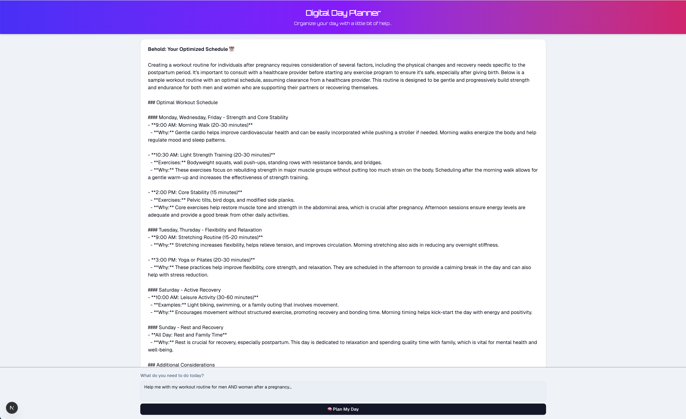
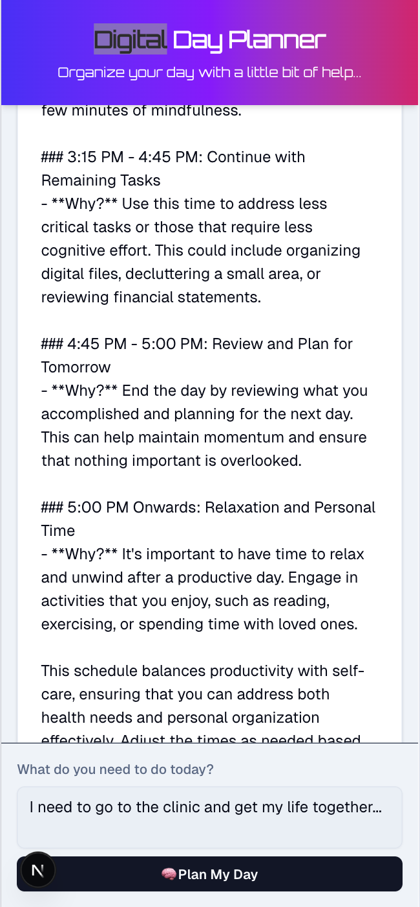

# Digital Day Planner Write-Up

## Project Overview
I built an AI-powered day planner using Next.js with the App Router, leveraging React and TanStack Query for state management. The app allows users to input daily tasks, which are then processed by an OpenAI model (GPT-4o) to generate an optimized schedule. The design is mobile-first, featuring a scrollable output area and a sticky input section, ensuring a seamless and accessible user experience.

## Technical Stack
- **Next.js (App Router):** Utilized for server and client components, ensuring secure API calls and efficient server-side rendering.
- **React & TanStack Query:** Employed for managing state and API calls, with built-in handling of loading, error, and caching states.
- **Tailwind CSS:** Provided rapid, responsive styling with a mobile-first approach. Custom gradients and dark mode support were added for a modern aesthetic.
- **OpenAI API:** Integrated in a secure, server-only API route to generate schedules using GPT-4o.
- **Vercel:** Deployed the app on Vercel, leveraging its seamless integration with Next.js for fast builds and global distribution.

## Key Features
- **Classy, Distinct UI:**  
  A sophisticated header with a gradient background and elegant typography sets a premium tone. The layout includes a sticky footer for task input, ensuring it remains accessible even when the schedule output is scrollable.

- **Robust State Management:**  
  TanStack Query manages API mutations, providing clear feedback for loading and error states, which ensures a smooth, responsive experience.

- **Security & Scalability:**  
  The OpenAI API key is securely handled server-side, with environment variables configured in Vercel for safe deployments.

- **Responsive & Accessible Design:**  
  The layout is optimized for both mobile and desktop, featuring clear, legible text and proper accessibility roles.

## Deployment & Workflow
- **Version Control & CI/CD:**  
  The code is maintained in a GitHub repository, with Vercel automating the build and deployment process.

- **Environment Configuration:**  
  Sensitive API keys are securely stored via environment variables, ensuring they are not exposed on the client side.

- **Modular & Future-Proof Architecture:**  
  The application’s modular design facilitates easy updates and the integration of additional features in the future.

## Screenshots

## Future Improvements
- **Enhanced UI Animations:**  
  Integrate custom animations using libraries like Framer Motion for smoother transitions and interactive feedback.

- **User Authentication & Personalization:**  
  Implement user accounts to allow users to save, manage, and personalize their schedules along with historical data.

- **Extended AI Capabilities:**  
  Expand the scheduling logic to handle more complex inputs and incorporate additional AI features such as natural language processing for advanced task prioritization.

- **Improved Error Handling & Notifications:**  
  Enhance error handling by implementing user-friendly notifications and advanced logging, possibly integrating with a monitoring service like Sentry.

- **Analytics & Monitoring:**  
  Integrate analytics tools to track user interactions and app performance, enabling data-driven improvements over time.

## Conclusion
This project showcases my ability to architect a full-stack web application using a modern tech stack, ensuring robust performance, scalability, and an exceptional user experience. By combining a clean design with effective state management and secure API integration, I delivered a polished, production-ready product. The modular architecture not only supports current functionalities but also sets the stage for future enhancements and scalability.
